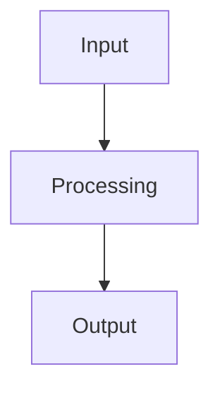

# phenotype-shared User Journeys

> Visual workflows for phenotype-shared

## Quick Navigation

| Journey | Time | Complexity |
|---------|------|------------|
| [Quick Start](./quick-start) | 5 min | ⭐ Beginner |
| [Core Integration](./core-integration) | 15 min | ⭐⭐ Intermediate |
| [Production Setup](./production-setup) | 30 min | ⭐⭐⭐ Advanced |

## Architecture

## Performance

| Metric | P50 | P95 |
|--------|-----|-----|
| Cold Start | < 10ms | < 50ms |
| Hot Path | < 1ms | < 5ms |
